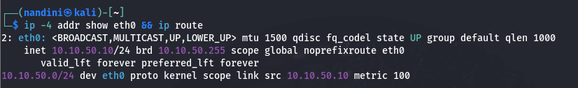
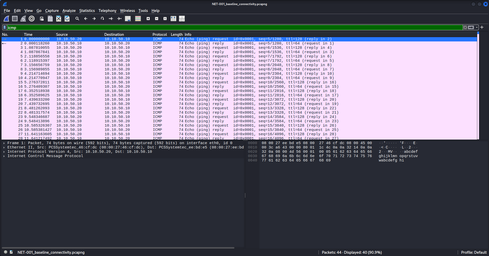
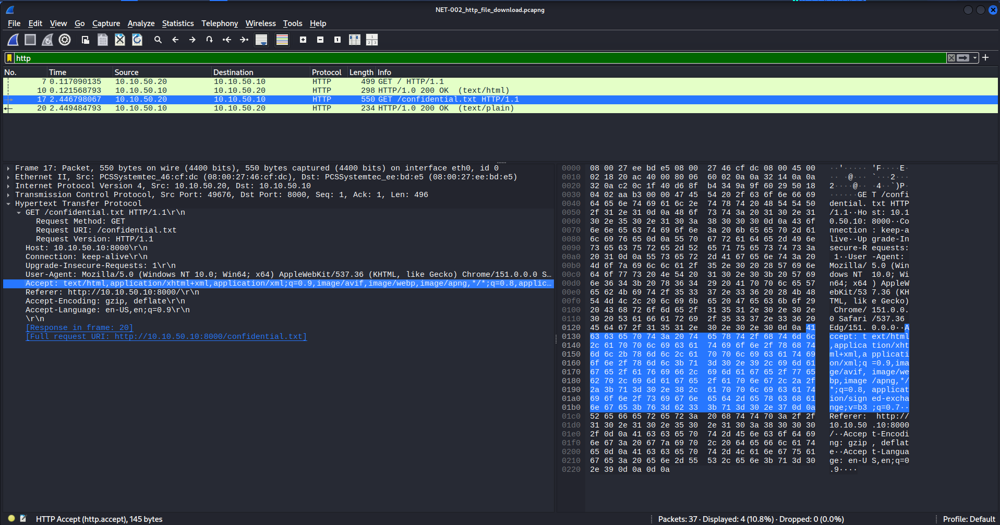

# Cyber Incident Investigation & Forensics Lab

## Overview

This project documents a simulated Digital Forensics and Incident Response (DFIR) investigation involving a suspected Windows workstation compromise.

The investigation is designed as a multi-source forensic analysis project in which network traffic, volatile memory, and filesystem artifacts are examined and correlated to reconstruct a simulated incident sequence.

Rather than analysing unrelated forensic datasets independently, the lab is structured to generate correlated artifacts from a common controlled incident scenario. The investigation focuses on identifying evidence of suspicious execution, repeated network communication, persistence-like activity, and test-data transfer within an isolated virtual environment.

> > **Project Status:** Active investigation. The isolated DFIR lab has been established, baseline and simulated network evidence have been acquired, and forensic documentation is actively being developed.

---

## Investigation Scenario

A Windows workstation within a fictional organisational environment is suspected of compromise following unusual outbound network activity.

The simulated investigation examines whether available forensic artifacts support a sequence involving:

1. User interaction with an externally obtained file.
2. Suspicious script or command-line execution.
3. Abnormal parent-child process relationships.
4. Repeated network communication.
5. Persistence-like system modification.
6. Test-data staging and transfer.

All incident activity is generated within a controlled virtual lab.

The project does not involve exploitation of unauthorised systems or intentional interaction with active malicious infrastructure.

---

## Investigation Objectives

The primary objectives are to:

- Preserve and verify forensic evidence integrity.
- Analyse packet capture data for suspicious communication patterns.
- Examine volatile memory for anomalous processes and execution artifacts.
- Investigate filesystem and user activity artifacts.
- Extract and document Indicators of Compromise (IOCs).
- Correlate network, memory, and filesystem evidence.
- Reconstruct a timestamp-based incident timeline.
- Map evidence-supported activity to the MITRE ATT&CK framework.
- Produce an evidence-supported technical incident conclusion.

---

## Lab Architecture

The simulated incident environment uses Oracle VirtualBox and a dedicated internal network named `DFIR-LAB`.

| System              | Role                                 | IPv4 Address  |
|---------------------|--------------------------------------|---------------|
| Kali Linux          | Controlled simulation node           | `10.10.50.10` |
| Windows workstation | Simulated victim and evidence source | `10.10.50.20` |

The lab network uses the IPv4 subnet `10.10.50.0/24`.

No IPv4 default gateway is configured for the isolated incident network.

The known lab topology and static addressing scheme are documented before incident evidence generation to support later forensic correlation.

Detailed architecture documentation is available in [`lab-architecture/lab_architecture.md`](lab-architecture/lab_architecture.md).

### Initial Network Validation

The Kali simulation node was assigned the static IPv4 address `10.10.50.10/24`.

The routing table showed only the directly connected `10.10.50.0/24` lab subnet and no IPv4 default route.



**Figure 1. Kali simulation node IPv4 configuration and routing state.**

---

## Investigation Snapshots

### Baseline ICMP Traffic Analysis (NET-001)

The initial network capture established a clean baseline of bidirectional ICMP communication between the Windows workstation and the Kali DFIR analysis system.



---

### HTTP File Download Simulation (NET-002)

A controlled HTTP file download was performed to generate forensic network artifacts for subsequent analysis. The capture includes the HTTP GET request, HTTP response, and successful object reconstruction.



---

## Forensic Workflow

The investigation follows the workflow below:

```text
Case Definition and Scoping
            ↓
Evidence Identification and Acquisition
            ↓
Evidence Integrity Verification
            ↓
Network Forensic Analysis
            ↓
Volatile Memory Analysis
            ↓
Disk and Filesystem Analysis
            ↓
IOC Extraction and Threat Intelligence Enrichment
            ↓
Cross-Source Artifact Correlation
            ↓
Incident Timeline Reconstruction
            ↓
MITRE ATT&CK Mapping
            ↓
Technical Incident Reporting

## Current Investigation Progress


### Completed

- [x] Defined the simulated incident scenario.
- [x] Established the investigation scope.
- [x] Defined evidence-driven investigation questions.
- [x] Created an evidence handling structure.
- [x] Created an evidence manifest.
- [x] Established a simulated chain-of-custody log.
- [x] Configured the Kali Linux simulation node.
- [x] Configured the Windows 10 workstation.
- [x] Created the isolated `DFIR-LAB` VirtualBox internal network.
- [x] Assigned static IPv4 addresses to both investigation systems.
- [x] Validated bidirectional network connectivity.
- [x] Acquired baseline network evidence (NET-001).
- [x] Acquired simulated HTTP evidence (NET-002).
- [x] Verified evidence integrity using SHA-256.
- [x] Performed baseline ICMP analysis.
- [x] Performed HTTP request/response analysis.
- [x] Documented forensic evidence metadata.

### In Progress / Planned

- [ ] Acquire volatile memory evidence.
- [ ] Acquire targeted disk or filesystem evidence.
- [ ] Perform volatile memory analysis.
- [ ] Perform disk and filesystem analysis.
- [ ] Extract Indicators of Compromise (IOCs).
- [ ] Correlate network, memory and filesystem evidence.
- [ ] Develop the master incident timeline.
- [ ] Map findings to the MITRE ATT&CK framework.
- [ ] Produce the final technical incident report.

---

## Repository Structure

```text
Cyber-Incident-Investigation-Forensics-Lab/
│
├── README.md
├── .gitignore
│
├── case-files/
│   ├── case_background.md
│   ├── incident_scope.md
│   └── investigation_questions.md
│
evidence/
│   ├── README.md
│   ├── evidence_manifest.csv
│   ├── evidence_metadata.md
│   ├── original/
│   ├── working-copies/
│   └── extracted-artifacts/│
├── chain-of-custody/
│   └── chain_of_custody.md
│
└── lab-architecture/
    ├── lab_architecture.md
    ├── network_validation.md
    ├── lab_command_reference.md
 ── screenshots/
    |── kali_network_configuration.png
    ├── 03_baseline_icmp_analysis.png
    └── 04_http_file_download_analysis.png
```

The repository structure will expand as network, memory, disk, timeline, IOC correlation, and reporting phases are completed.

---

## Evidence Handling

Original forensic evidence is preserved separately from designated working copies and extracted artifacts.

SHA-256 is used as the primary evidence integrity verification algorithm.

Large forensic evidence files and potentially suspicious executable artifacts are excluded from the public repository through `.gitignore`.

Where evidence is not published directly, the project documentation will retain relevant metadata such as:

- Evidence identifier.
- Evidence type.
- Filename.
- Acquisition method.
- Acquisition timestamp.
- File size.
- SHA-256 hash.
- Evidence handling status.

See [`evidence/README.md`](evidence/README.md) for the documented evidence handling workflow.

---

## Tools and Technologies

Tools planned or used during the investigation include:

### Network Forensics

- Wireshark
- Linux networking utilities

### Memory Forensics

- Volatility 3
- Volatility Workbench

### Disk and Filesystem Forensics

- Autopsy
- FTK Imager

### Lab and System Configuration

- Oracle VirtualBox
- Kali Linux
- Windows
- NetworkManager (`nmcli`)

### Automation and Correlation

- Python

### Threat Intelligence

- Public OSINT resources
- Public threat intelligence resources

The use of each forensic tool will be documented according to its role in the investigation rather than treated as evidence of a finding by itself.

---

## Investigation Documentation

The project documentation currently includes:

- [Case Background](case-files/case_background.md)
- [Incident Investigation Scope](case-files/incident_scope.md)
- [Investigation Questions](case-files/investigation_questions.md)
- [Evidence Handling Documentation](evidence/README.md)
- [Evidence Handling and Chain of Custody Log](chain-of-custody/chain_of_custody.md)
- [DFIR Lab Architecture](lab-architecture/lab_architecture.md)
- [Isolated Network Validation](lab-architecture/network_validation.md)
- [Lab Command Reference](lab-architecture/lab_command_reference.md)

---

## Evidence Standard

Major investigative conclusions should be supported by observable forensic artifacts where possible.

Relevant findings may reference:

- Packet numbers.
- Timestamps.
- Source and destination IP addresses.
- Domain names.
- Process identifiers.
- Process names.
- Parent-child process relationships.
- Command-line artifacts.
- File paths.
- Cryptographic hashes.
- Registry or persistence artifacts.
- Forensic tool output.

Questions that cannot be conclusively answered using the available evidence will be documented as inconclusive rather than assumed.

---

## Ethical and Safety Statement

This repository documents a controlled cybersecurity lab created for academic and portfolio purposes.

The simulated incident environment is designed to generate forensic artifacts without targeting unauthorised systems.

No active malicious infrastructure is intentionally contacted during the investigation.

Potentially suspicious extracted artifacts will not be published as directly executable files in this public repository.

---

## Project Scope and Limitations

This project represents a simulated DFIR investigation and is not a legal forensic examination.

The investigation conclusions are limited to the artifacts generated and acquired within the controlled lab environment.

The absence of a specific artifact will not automatically be interpreted as proof that an activity did not occur.

Resource constraints may require targeted or logical filesystem acquisition rather than a complete physical disk image.

Where targeted acquisition is used, the acquisition scope and resulting forensic limitations will be explicitly documented in the relevant analysis and final investigation reports.

---

## Author

**Nandini Sharma**

B.Tech Computer Science and Engineering  
Cyber Security

---

## Project Status

**Active Investigation — Lab Environment Established**